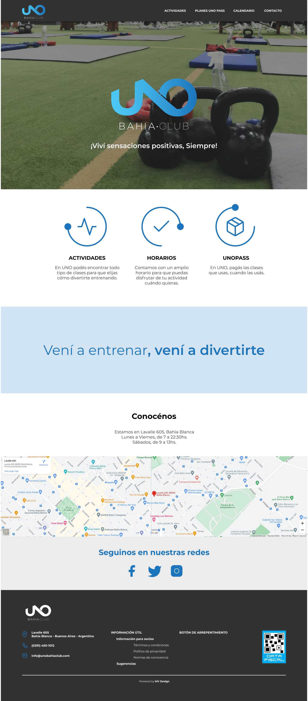

# UNO Bahía Club
CODERHOUSE | DESARROLLO WEB | #55445

_Uno Bahía Club, es uno de los gimnasios más completos e importantes de Bahía Blanca. El objetivo principal de la web, es informar acerca de las actividades que se pueden realizar dentro del club y sobre el sistema de "créditos" que maneja la institución para acceder a ciertos paquetes de actividades. Además cuenta con un acceso para los clientes para que puedan reservar su lugar en la clase que deseen o hayan adquirido._

## El Proyecto 🚀

La realización de este proyecto surge en el año 2022 cuando realicé el curso de UX/UI Avanzado en Coderhouse.
La consigna en su momento consistia en realizar el rediseño de el sitio web que nos gustara, donde se puedan aplicar todas las leyes de UX y mejorar en función de las mismas la UI.

------- https://www.behance.net/gallery/160024075/Rediseno-UXUI-Website-UNO-Bahia-Club -------

Debido a que fue un proyecto que me generó mucha motivación y entusiasmo, y a su vez hace algunos años comencé a incursionar en el mundo del desarrollo..., decidí tomar la carrera de Desarrollo Web en Coder, para poder completar el proyecto en cuestión y asi ampliar y afianzar mis conocimientos previos en el area. 

## Lenguajes y Tecnologías 🛠️

Para llevar a cabo mi proyecto, utilicé los siguientes lenguajes y tecnologías:

HTML5
| Visual Studio Code
| CSS
| SASS
| Bootstrap
| Figma
| Git
| GitHub
| GitHub Pages
| Netlify

## Vista Previa de nuestro proyecto

## Links

* GitHub Pages 
https://mmvergnes.github.io/UnoNewWeb/

* Repositorio GitHub
https://github.com/mmvergnes/UnoNewWeb

* Dominio en Netlify
https://unonewweb.netlify.app/

## Autor ✒️

* **María Mercedes Vergnes** - UX/UI, Diseño, Maquetación, Codeo - https://www.behance.net/mervergnes

## Expresiones de Gratitud 🎁

* Comenta a otros sobre este proyecto 📢

---
👩‍💻 [mmvergnes](https://github.com/mmvergnes) 🇦🇷
